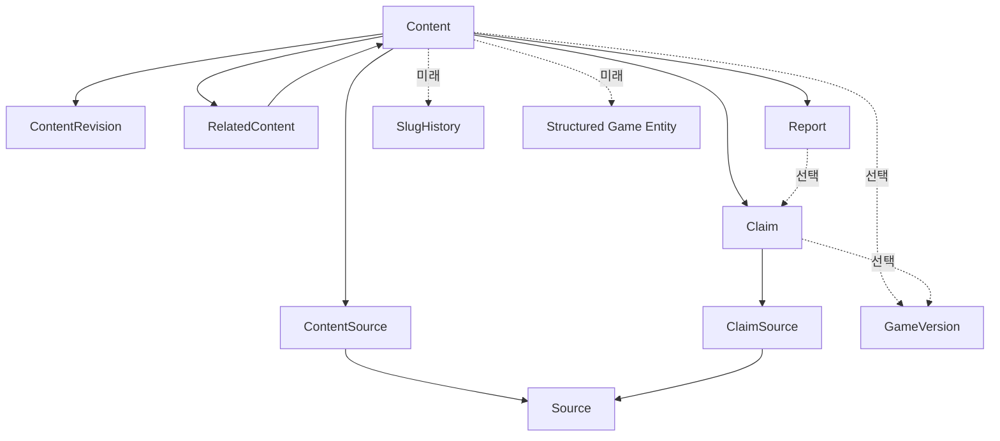

# 콘텐츠 데이터 모델 초안

- 문서 상태: 검토 가능한 개념 설계 초안
- 기준일: 2026-08-28
- 관련 문서: `AGENTS.md`, `PROJECT_BRIEF.md`, `docs/PRODUCT_SCOPE.md`, `docs/SOURCE_REGISTRY.md`
- 범위: 콘텐츠 운영에 필요한 개념과 관계

이 문서는 실제 DB 테이블, 컬럼 타입, ORM 또는 프레임워크를 정하지 않는다. 출시 전에는 1인 또는 소규모 운영자가 관리할 수 있는 최소 구조를 우선하고, 출시 후 실제 데이터와 운영 경험이 생길 때 확장한다.

## 1. 설계 목표

콘텐츠 모델은 다음 문제를 해결해야 한다.

- 방문자에게 현재 유효한 정보를 먼저 보여줄 수 있어야 한다.
- 어떤 정보가 공식적으로 확인됐고 언제 마지막으로 검수됐는지 추적할 수 있어야 한다.
- 페이지 전체에 출처를 나열하는 데 그치지 않고, 검증이 중요한 핵심 주장과 근거 출처를 연결할 수 있어야 한다.
- 패치나 공식 발표로 정보가 바뀌어도 과거 값, 대체 관계, 변경 이유를 잃지 않아야 한다.
- `draft`, `review`, `published`, `archived` 상태와 검수 흐름을 지원해야 한다.
- 공개되지 않은 콘텐츠는 일반 사용자, 공개 API, 사이트 검색, sitemap 및 검색엔진 색인에 노출되지 않아야 한다.
- 운영자가 출처 등록, 작성, 검수, 정정, 임시 비공개를 빠르게 처리할 수 있어야 한다.
- 출시 후 아이템, 직업, 스킬, NPC, 몬스터 등 구조화된 게임 데이터로 확장할 여지를 남겨야 한다.

모델의 목표는 모든 가능성을 미리 표현하는 것이 아니다. 출시 전 초기 콘텐츠 8개를 안정적으로 운영할 수 있고, 실제 반복 작업이 확인됐을 때만 구조를 추가할 수 있으면 충분하다.

## 2. 핵심 개념 모델

| 개념 | 역할 | MVP 판단 |
|---|---|---|
| `Content` | 사용자가 방문하는 문서 단위 | 필수 |
| `Claim` | 출처 검증이 중요한 핵심 주장 | 필수, 필요한 주장에만 선택적으로 사용 |
| `Source` | 공식 공지, 보도자료, 영상 등 출처 자체 | 필수 |
| `ContentSource` | 문서 전체의 참고·배경 출처 관계 | 필수 기능, 가벼운 연결로 시작 가능 |
| `ClaimSource` | 특정 주장과 출처의 근거 관계 | 필수 |
| `ContentRevision` | 의미 있는 콘텐츠 변경과 상태 변화의 이력 | 필수, 경량 운영 |
| `GameVersion` | 게임의 패치·업데이트 또는 기준 버전 | 개념만 고려, 공식 버전 체계 확인 후 사용 |
| `RelatedContent` | 문서 사이의 관련 항목 연결 | 필수 기능, 독립 모델 여부는 추후 결정 |
| `Report` | 잘못된 정보 신고와 처리 결과 | 필수 |
| `SlugHistory` | 이전 slug와 리디렉션 이력 | 확장 후보 |
| `Category` / `Tag` | 탐색과 분류 보조 | 초기에는 단순 분류로 충분하며 별도 개념은 확장 후보 |

출처 관계는 문서 전체의 참고 자료를 연결하는 `Content → ContentSource → Source`와 핵심 주장의 근거를 연결하는 `Content → Claim → ClaimSource → Source`로 나뉜다. `ContentRevision`은 사이트 문서의 편집 이력을, `GameVersion`은 게임 자체의 변화를 표현한다. 둘을 같은 개념으로 취급하지 않는다.

## 3. Content

### 역할과 필요성

`Content`는 방문자가 실제 URL로 접근하는 편집 문서다. 게임 소개, 출시 일정, 사전예약, 세계관, 쇼케이스 요약, 직업 가이드, 패치노트 요약 등이 여기에 해당한다.

본문, 공개 상태, URL, 최신성 정보를 한곳에서 관리해 작성·검수·공개 흐름의 기준점이 된다.

### 주요 속성 후보

- 내부 식별자
- `content_type`: 소개, 가이드, 공식 소식 요약, FAQ 등 문서 성격
- `title`
- `slug`
- `summary`: 한줄 답변 또는 검색 결과용 요약
- `body`
- `status`: `draft`, `review`, `published`, `archived`
- 작성자·담당자 참조
- `created_at`, `updated_at`, `published_at`
- `checked_at`: 내용 전체를 마지막으로 검수한 시점
- 적용 게임 버전 참조 또는 날짜 기반 기준 시점
- 재검수 예정 시점 후보
- SEO 제목·설명 선택적 덮어쓰기 값

SEO 제목과 설명을 모든 문서에서 별도 입력하도록 강제하지 않는다. 기본값은 `title`과 `summary`에서 생성하고, 검색 결과 표현을 별도로 조정해야 하는 문서만 선택적으로 덮어쓰는 방향이 운영 부담이 적다.

### 관계

- 하나의 `Content`는 필요한 만큼의 `Claim`을 가진다.
- 하나의 `Content`는 `ContentSource`를 통해 문서 전체의 참고 출처를 연결할 수 있다.
- 여러 `Content`와 `Claim`이 같은 `Source`를 각각 `ContentSource`와 `ClaimSource`를 통해 재사용할 수 있다.
- 하나의 `Content`는 여러 `ContentRevision`, `RelatedContent`, `Report`와 연결될 수 있다.
- `GameVersion` 연결은 선택 사항이며, 버전이 없는 일정·세계관 문서는 기준 시점으로 관리할 수 있다.

### 단계 판단

출시 전 MVP 필수다. 단, `content_type` 종류와 SEO 덮어쓰기 항목은 초기 콘텐츠에 필요한 최소 범위만 사용한다.

## 4. Claim

### 역할과 범위

`Claim`은 페이지의 모든 문장을 분해한 것이 아니라, 출처 확인과 변경 추적이 특히 중요한 검증 가능 주장이다.

예시는 다음과 같다.

- 정식 출시는 2026년 10월 예정이다.
- 사전예약은 2026년 8월 20일 시작됐다.
- 개발사는 슈퍼캣이다.

### Claim으로 관리할 기준

다음 중 하나에 해당하면 Claim으로 관리할 가치가 높다.

- 출시·점검·이벤트·쿠폰 등의 일정
- 스킬 수치, 보상, 확률, 제한 조건 등 정확성이 중요한 값
- 게임 시스템 규칙과 지원 플랫폼·서비스 지역
- 개발사, 퍼블리셔, 원작 관계처럼 공식 확인이 필요한 사실
- 변경될 가능성이 높거나 잘못되었을 때 사용자 피해가 큰 정보
- 서로 다른 출처가 충돌하거나 최신 발표가 이전 발표를 대체한 정보

단순한 설명, 문단을 연결하는 문장, 편집자의 표현까지 Claim으로 만들지 않는다. 한 페이지에서 관리 가치가 높은 소수의 주장부터 등록한다.

### Content.body와의 관계

Claim은 본문의 모든 문장이나 문자열 위치를 자동 추적하는 annotation 시스템이 아니다. 검증 가치가 높은 핵심 사실을 별도로 구조화하고, `Content.body`는 그 사실을 문맥에 맞게 자연스럽게 설명한다.

본문과 Claim이 같은 사실을 표현하더라도 완전히 동일한 문자열일 필요는 없다. 향후 Claim을 요약 카드, 핵심 정보 박스, 검증 정보 영역 등에 직접 표시하는 방안도 검토할 수 있지만, 본문의 특정 문장 위치를 추적하거나 양쪽을 자동 동기화하는 기능은 MVP 범위에 포함하지 않는다.

중요한 사실이 변경되면 운영자는 관련 Claim, 본문, 요약을 검수 과정에서 함께 확인해 서로 모순되지 않게 해야 한다. Claim은 본문을 대체하지 않으며, 본문만 수정해 핵심 사실의 출처·유효성 기록을 우회해서도 안 된다.

### 주요 속성 후보

- 내부 식별자
- 연결된 `Content`
- 주장 내용 또는 짧은 요약
- `claim_type` 또는 `fact_type`: 일정, 수치, 규칙, 관계 등 분류 후보
- 내용 성격: `fact`, `interpretation`, `unverified` 구분 후보
- 검증 또는 유효성 상태
- `checked_at`
- `valid_from`, `valid_until`
- 현재 유효 여부 또는 대체된 주장과의 관계
- 선택적 `GameVersion` 참조

`fact`, `interpretation`, `unverified`는 사실의 성격을 구분하기 위한 것이며 공개 허용 상태가 아니다. `unverified` 정보는 기존 정책대로 공개하지 않는다. 편집자의 해석을 제공할 필요가 있다면 해석임을 명확히 표시하고 근거와 분리한다.

### 관계와 단계 판단

- 하나의 Claim은 하나의 Content에 속하는 것을 기본으로 한다.
- 하나의 Claim은 하나 이상의 `ClaimSource`를 통해 근거를 가질 수 있다.
- 특정 사실이 바뀌면 기존 Claim을 지우기보다 유효 기간 또는 대체 관계를 남기는 방향을 검토한다.

출시 전 MVP에 필수지만 모든 본문 문장에 적용하지 않는다. 초기에는 일정, 사전예약, 플랫폼, 개발·서비스 주체 등 핵심 주장에만 사용한다.

## 5. Source, ContentSource와 ClaimSource

### Source

`Source`는 출처 자체를 표현한다. 속성, 우선순위, 충돌 처리, 신선도, 권리 기록은 `docs/SOURCE_REGISTRY.md`를 기준으로 하며 이 문서에서 중복 정의하지 않는다.

최소한 다음 항목을 재사용할 수 있어야 한다.

- `url`, `publisher`, `title`
- `published_at`, `checked_at`
- `source_tier`, `source_type`, `language`
- `valid_from`, `valid_until`
- `supersedes`, `rights_note`, `status`

같은 URL의 출처를 여러 번 복제하지 않고 여러 Content와 Claim에서 재사용할 수 있어야 한다.

### ContentSource

`ContentSource`는 특정 Content 전체를 작성할 때 참고한 배경 자료, 일반 참고자료, 추가 읽기 출처를 Source와 연결하는 개념이다. 모든 설명 문장을 Claim으로 만들지 않으면서도 문서가 참고한 출처를 보여주기 위해 필요하다.

- 특정 핵심 주장의 직접 근거는 계속 `ClaimSource`로 연결한다.
- 같은 Source가 한 문서의 `ContentSource`이면서 특정 Claim의 `ClaimSource`일 수 있다.
- 페이지 하단의 참고자료나 추가 읽기 목록에 활용할 수 있다.
- `ContentSource`는 `ClaimSource`를 대체하거나 핵심 사실의 Claim 등록을 생략하는 수단이 아니다.

문서 전체 참고 출처 연결 기능은 출시 전 MVP에 유용하다. 다만 실제 저장 방식이나 별도 관리 UI를 확정하지 않으며, 초기에는 소규모 운영에 맞는 가벼운 연결 방식으로 충분할 수 있다.

### ClaimSource

`ClaimSource`는 특정 Source가 특정 Claim을 어떤 방식으로 뒷받침하는지 기록하는 연결 개념이다. 출처 목록만으로는 어느 문장이 어느 근거에 의존하는지 알기 어렵기 때문에 필요하다.

주요 속성 후보는 다음과 같다.

- 연결된 `Claim`
- 연결된 `Source`
- 근거 역할: 직접 근거, 보조 근거, 맥락, 충돌 자료 등
- 출처 안의 위치: 문단·절·페이지 등 사람이 다시 찾을 수 있는 표시
- 영상 타임스탬프
- 짧은 근거 메모
- 연결 확인 시점

근거 역할의 정확한 명칭과 종류는 운영 사례를 보고 확정한다. Source 자체의 등급과 ClaimSource의 근거 역할은 다르다. 높은 등급의 Source라도 특정 Claim을 직접 뒷받침하지 않을 수 있다.

Source, ContentSource 연결 기능, ClaimSource 연결 기능은 출시 전 MVP에 필요하다. 이를 각각 독립 테이블이나 복잡한 관리 화면으로 구현해야 한다는 뜻은 아니다.

## 6. 게임 버전과 시간에 따른 유효성

### 구분 원칙

- 문서의 오타를 고친 것은 사이트 콘텐츠 변경이다.
- 패치로 스킬 수치가 바뀐 것은 게임 상태 변경이다.

전자는 `ContentRevision`, 후자는 `GameVersion`과 Claim의 유효 기간으로 표현한다.

### GameVersion 후보

`GameVersion`은 패치, 업데이트 또는 운영상 기준 버전을 나타내는 개념이다.

주요 속성 후보는 최소한으로 둔다.

- 내부 식별자
- `version_label`: 공식 명칭 또는 운영상 표시 이름
- `released_at`
- 공식 패치 출처 참조 후보
- 짧은 `notes`

정확한 버전 체계는 출시 전에는 알 수 없으므로 번호 형식이나 계층을 확정하지 않는다. 공식 버전이 없는 정보는 `checked_at`, `valid_from`, `valid_until`과 같은 날짜 기준으로 관리한다.

Content 전체가 특정 버전에 적용될 수도 있고 Claim 하나만 특정 버전에서 바뀔 수도 있다. 따라서 향후에는 양쪽의 선택적 연결 가능성을 검토하되, 출시 전에는 날짜 기반 유효성을 우선한다.

`GameVersion`은 구조만 고려하고 아직 실제 운영을 강제하지 않는다. 공식 패치 체계가 공개된 뒤 도입 여부와 연결 단위를 결정한다.

## 7. ContentRevision과 변경 이력

### 역할

`ContentRevision`은 문서 내용과 편집 상태가 의미 있게 바뀐 시점을 기록한다.

다음 정보를 확인할 수 있어야 한다.

- 무엇이 변경됐는지
- 언제 변경됐는지
- 누가 변경했는지
- 변경 이유
- 변경 전 내용을 확인하거나 필요 시 복원할 수 있는지
- `draft → review → published → archived`와 같은 상태 변화

### 운영 수준

Git처럼 모든 키 입력이나 자동 저장마다 revision을 만들 필요는 없다. 다음과 같은 의미 있는 사건을 우선 기록한다.

- 검수 요청
- 공개 또는 재공개
- 공개 내용의 정정
- 출처 변경이나 핵심 Claim 변경
- 임시 비공개 또는 archived 전환
- 운영자가 명시적으로 저장한 주요 버전

초기에는 변경 요약, 변경 이유, 담당자, 시점, 주요 이전 값을 확인할 수 있는 경량 이력으로 충분하다. 전체 스냅샷과 필드별 차이 중 어떤 방식을 쓸지는 본문 저장 방식과 운영 경험이 생긴 뒤 결정한다.

### Audit log와의 차이

- `ContentRevision`은 문서의 편집 결과와 복원 가능한 내용 변화가 중심이다.
- audit log는 로그인, 권한 변경, 공개 승인, 관리자 작업 등 누가 언제 어떤 관리 행위를 했는지 추적하는 보안·운영 기록이다.

초기 콘텐츠 변경에서는 두 기록이 일부 같은 정보를 가질 수 있지만 목적은 다르다. 한 기록으로 시작하더라도 향후 보안 사건과 콘텐츠 복원 요구가 생기면 분리할 수 있어야 한다. 구체적인 로그 저장 방식과 보관 기간은 기술 설계 단계에서 정한다.

`ContentRevision`은 출시 전 MVP 필수이며, 모든 미세 입력이 아닌 의미 있는 변경만 기록한다.

## 8. RelatedContent

### 역할과 필요성

`RelatedContent`는 문서 사이의 관련 항목을 구조화해 연결한다.

- 출시 일정 ↔ 사전예약 ↔ 쇼케이스
- 직업 ↔ 스킬 ↔ 장비

본문에 URL을 직접 삽입하는 방식만 사용하면 문서 제목이나 slug 변경 시 링크 관리가 어렵고, 역방향 관계와 일관된 관련 문서 목록을 만들기 어렵다. 구조화된 관계는 내부 식별자를 기준으로 링크를 유지하고, 관련 문서를 자동으로 찾거나 정렬할 수 있게 한다.

### 관계 정보 후보

- 출발 `Content`
- 대상 `Content`
- 관계 종류 후보
- 표시 순서 또는 편집 메모 후보

관련 문서 연결 기능 자체는 MVP에서 유용하지만 실제 저장 방식은 아직 결정하지 않는다. 초기 문서가 5~10개 수준일 때는 단순한 관련 Content 식별자 목록이나 이에 준하는 가벼운 방식으로도 충분할 수 있다.

문서 수와 관계 종류가 늘어나면 독립적인 RelatedContent 관계 모델로 발전시킬 수 있다. 방향성, 관계 종류, 표시 순서, 중복 방지 같은 기능은 실제 필요가 확인된 뒤 추가한다. 즉, MVP에서 필요한 것은 관련 문서를 보여주는 기능이며 독립 엔티티와 별도 관리자 UI는 필수가 아니다.

## 9. 잘못된 정보 신고

### Report 역할

`Report`는 방문자가 잘못되었거나 오래된 정보를 알리고 운영자의 검수 대기열로 연결하는 기록이다.

### 주요 속성 후보

- 내부 식별자
- 대상 `Content`
- 대상 `Claim` 선택 참조
- 신고 유형: 사실 오류, 오래된 정보, 깨진 출처, 권리·개인정보 문제 등 후보
- 신고 내용
- 처리 상태
- 접수 시점
- 처리 시점
- 처리 결과 또는 운영 메모
- 필요한 경우에만 최소한의 회신 정보

모든 Report는 Content와 연결하고, 어느 핵심 주장의 문제인지 명확할 때만 Claim을 선택적으로 연결한다. 신고가 접수되면 검수 대기열에서 확인할 수 있어야 하며, 정정·삭제 요청은 `AGENTS.md`의 처리 원칙을 따른다.

로그인 시스템과 신고자 계정 모델은 확정하지 않는다. 익명 또는 회신 정보 입력 방식도 추후 결정하며, 어떤 방식이든 처리 목적에 필요한 최소 개인정보만 수집한다.

Report는 출시 전 MVP 필수다. 자동 제재, 사용자 평판, 복잡한 티켓 시스템은 포함하지 않는다.

## 10. URL과 Slug

### 기본 원칙

- 내부 식별자는 콘텐츠 관계의 안정성을 위해 사용하고, slug는 사람이 읽고 검색엔진이 이해하기 쉬운 공개 URL에 사용한다.
- 제목 변경이 곧 slug 변경을 의미하지 않게 한다.
- 공개한 slug는 가능한 한 유지한다.
- `draft`와 `review` 콘텐츠는 공개 URL, 공개 API, 사이트 검색, sitemap에서 제외하고 검색엔진에 노출되지 않게 한다.
- `archived`는 삭제가 아니다. 읽기 전용으로 공개하는 경우 URL을 유지하고 최신 정보가 아님을 표시하며 가능한 경우 최신 대체 문서를 안내한다.
- 개인정보·권리 문제로 내용을 공개할 수 없는 경우에는 URL 유지 여부와 응답 방식을 사안별로 결정한다.

### SlugHistory 판단

이전 URL 리디렉션을 안정적으로 관리하려면 `SlugHistory`가 유용하다. 후보 정보는 이전 slug, 대상 Content, 변경 시점, 변경 이유 정도다.

다만 초기에는 slug 변경을 예외로 제한하고 안정적인 slug를 유지하면 별도 개념 없이 운영할 수 있다. 따라서 출시 전 MVP의 독립 필수 개념으로 두지 않고, 실제 slug 변경이 발생하거나 리디렉션 관리 요구가 확인될 때 추가한다. 공개 후 slug를 변경해야 한다면 SlugHistory 또는 이에 준하는 리디렉션 기록 없이 이전 URL을 버리지 않는다.

## 11. Editorial Content와 Structured Game Entity

### 개념 구분

`Editorial Content`는 사람이 읽는 설명·가이드·요약 문서다. `Content`, `Claim`, 출처, revision이 중심이다.

`Structured Game Entity`는 출시 후 검색·필터·비교에 쓰이는 직업, 스킬, 아이템, 장비, 몬스터, 보스, NPC, 지역, 던전, 제작 재료 등의 게임 객체다.

모든 게임 데이터를 Content 본문에만 저장하면 다음 문제가 생길 수 있다.

- 획득처, 속성, 지역 등 구조화된 필터가 어렵다.
- 여러 문서에서 같은 수치를 중복 관리하게 된다.
- 패치로 값이 바뀔 때 영향 범위를 찾기 어렵다.
- 객체 간 관계를 일관되게 연결하기 어렵다.

반대로 출시 전부터 모든 게임 객체와 필드를 설계하면 공개되지 않은 정보를 추측하게 되고 운영 복잡도만 커진다.

### 단계 제안

출시 전 MVP에서는 Editorial Content만 실제 범위로 삼는다. 다만 Content가 미래 게임 객체를 소개하거나 연결할 수 있도록 내부 식별자와 관련 콘텐츠 구조를 안정적으로 유지한다.

출시 후에는 실제 검색 수요와 공식·직접 검증 가능한 데이터를 보고 반복되는 필드가 많은 영역부터 Structured Game Entity로 분리한다. Item, Monster 등의 실제 상세 구조는 지금 설계하지 않는다. 게임 객체도 설명 페이지가 필요하다면 향후 Content와 1:1 또는 선택적으로 연결하는 방식을 검토할 수 있다.

## 12. 상태와 공개 흐름

### 기본 상태

- `draft`: 작성 중. 운영자만 접근하며 외부에 노출하지 않는다.
- `review`: 출처·표현·권리 검수 중. 외부에 노출하지 않는다.
- `published`: 공개 기준을 충족해 일반 사용자에게 노출한다.
- `archived`: 더 이상 최신 문서로 사용하지 않지만 이력 보존이 필요하다.

기본 흐름은 다음과 같다.

`draft → review → published → archived`

정정 후 재공개처럼 `published → review → published` 흐름도 허용할 수 있으며 모든 전환 이유를 revision 또는 이에 준하는 기록에 남긴다.

### 노출 원칙

- 기본 공개 대상은 `published`다.
- `draft`와 `review`는 일반 사용자에게 노출하지 않으며 공개 API, 사이트 검색, sitemap과 검색엔진 색인에서도 제외한다.
- `archived`는 삭제 상태가 아니다. 이전 패치 정보, 변경 이력 등 보존 가치가 있으면 읽기 전용으로 공개할 수 있다.
- 공개된 `archived` 문서는 최신 정보가 아님을 명확히 표시하고 가능한 경우 최신 대체 문서를 안내한다.
- 권리 또는 개인정보 문제로 내부에만 보관하고 외부에는 공개하지 않는 `archived` 콘텐츠도 있을 수 있다.
- 출처 재확인이나 정정 요청으로 긴급 조치가 필요하면 기존 상태를 늘리기보다 “공개 보류”를 별도의 가시성 조건으로 기록하는 방안을 우선 검토한다.

상태는 편집 생명주기를 나타내고 실제 노출 여부와 항상 완전히 같은 개념은 아닐 수 있다. 그렇다고 현재 `visibility`, `suspended`, `hidden` 같은 별도 필드나 상태를 확정하지는 않는다. 임시 비공개 사례가 반복돼 별도 모델이 실제로 필요해질 때 도입하며, 그전에도 직전 공개 상태와 조치 이유는 변경 이력에 남겨야 한다.

## 13. 관계도

이 관계도는 개념 간 방향을 설명할 뿐 실제 테이블 구조나 소유 관계를 확정하지 않는다. 특히 ContentSource와 RelatedContent의 저장 방식, GameVersion 연결 단위, Structured Game Entity 연결 방식은 후속 설계 대상이다.

## 14. MVP와 미래 확장 구분

### A. 출시 전 MVP에 반드시 필요한 것

- `Content`: 초기 공개 문서와 네 가지 상태 관리
- 선택적 `Claim`: 일정·보상·공식 주체 등 핵심 주장만 관리
- `Source`: `SOURCE_REGISTRY.md`의 필드와 운영 규칙 재사용
- `ContentSource`: 문서 전체의 참고·배경 출처 연결 기능
- `ClaimSource`: 핵심 주장과 직접·보조 근거 연결
- 경량 `ContentRevision`: 공개, 정정, 출처 변경, 상태 전환 등 의미 있는 이력
- `RelatedContent`: 관련 문서 노출 기능은 제공하되 독립 모델 구현 여부는 추후 결정
- `Report`: Content 필수, Claim 선택 연결 및 검수 대기열
- 안정적인 `slug`, 공개 시점, 마지막 검수일, 날짜 기반 유효성
- `published`를 기본 공개하고 `draft`·`review`는 제외하며 `archived`는 보존 목적에 따라 조건부로 읽기 전용 공개하는 규칙

### B. 구조만 고려하고 아직 구현하지 않을 것

- 공식 버전 체계 확인 전의 `GameVersion`
- slug 변경 이력을 위한 `SlugHistory`
- 독립적인 RelatedContent 관계 모델과 방향·종류·표시 순서
- Category와 Tag의 독립된 관리 개념
- 콘텐츠 전용 revision과 보안 audit log의 완전한 분리 방식
- 임시 비공개가 반복될 때의 별도 상태 또는 공개 보류 모델
- Content와 미래 Structured Game Entity의 구체적인 연결 방식

### C. 출시 후 실제 게임 데이터를 보고 결정할 것

- 직업, 스킬, 아이템, 장비, 몬스터, 보스, NPC, 지역, 던전, 제작 재료의 상세 모델
- 패치별 수치 유효 기간과 GameVersion 연결 단위
- 게임 객체 사이의 획득처, 드롭, 제작, 선행 조건 등 관계
- 구조화된 필터와 비교에 필요한 공통 필드
- 검색 실패어와 운영 변경량을 근거로 한 데이터 분리 우선순위

## 15. 남은 결정 사항

다음은 이 문서에서 결정하지 않는다.

- 실제 DB 제품과 배포 방식
- ORM 또는 데이터 접근 기술
- UUID와 숫자 ID 중 어떤 식별자를 사용할지
- 본문 저장 형식과 revision 저장 방식
- Markdown과 Rich Text Editor 중 어떤 편집 방식을 사용할지
- 검색 엔진과 색인 구현 방식
- 관리자 인증, 2단계 인증, 역할·권한 구현 방식
- audit log의 저장 위치와 보관 기간
- 공식 게임 버전 식별 규칙과 GameVersion 도입 시점
- Claim 상태와 ContentSource·ClaimSource 관계 역할의 정확한 열거값
- slug 변경과 리디렉션의 구체 구현 방식
- 신고자 회신 정보와 개인정보 보관 기간
- SEO 자동 생성과 선택적 덮어쓰기의 구체 규칙
- Structured Game Entity의 종류, 상세 필드, Content와의 연결 방식
- 백업 범위, 주기, 보관 기간과 복구 목표

기존 문서와 충돌하는 결정 사항은 없다. 다만 GameVersion, 임시 비공개 표현 방식, revision과 audit log의 분리 수준, SlugHistory 도입 시점은 실제 운영 요구가 확인된 뒤 추가 결정을 내려야 한다.
