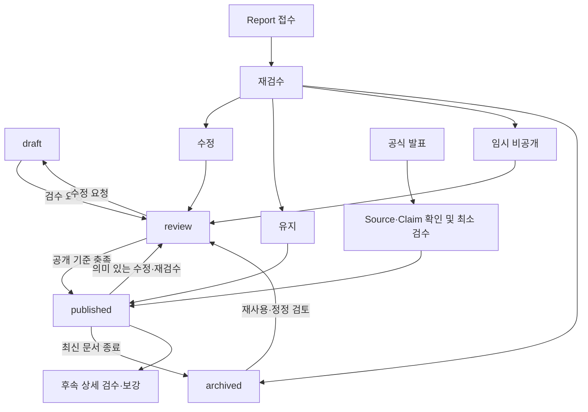

# 관리자 콘텐츠 작성·검수·공개 운영 흐름 초안

- 문서 상태: 검토 가능한 운영 설계 초안
- 기준일: 2026-08-28
- 관련 문서: `AGENTS.md`, `PROJECT_BRIEF.md`, `docs/PRODUCT_SCOPE.md`, `docs/SOURCE_REGISTRY.md`, `docs/CONTENT_MODEL.md`
- 범위: 관리자 편집 운영 규칙과 상태 변화

이 문서는 관리자 화면, API, DB 스키마, 인증 기술 또는 기술 스택을 설계하지 않는다. 출시 전에는 1인 또는 소규모 운영자가 실제로 반복할 수 있는 단순한 흐름을 우선한다.

## 1. 문서 목적

이 문서는 운영자가 콘텐츠를 작성하고 출처와 핵심 주장을 연결한 뒤 검수·공개·정정하는 전체 편집 흐름을 정의한다.

대상 흐름은 다음과 같다.

- 새 콘텐츠 작성
- Source 등록과 ContentSource 연결
- Claim 등록과 ClaimSource 연결
- 검수 요청과 수정 요청
- 공개와 재검수
- 정정, 임시 비공개, archived 처리
- 잘못된 정보 신고 처리
- 공식 발표나 패치로 기존 정보가 바뀐 경우
- 쇼케이스, 출시일 발표, 긴급 공지처럼 정보가 빠르게 들어오는 경우

화면 배치나 컴포넌트보다 누가 무엇을 확인하고 어떤 이유로 상태를 바꾸는지에 집중한다. 세부 구현보다 공개 정보의 정확성, 출처 추적, 변경 이력 보존을 우선한다.

## 2. 기본 편집 흐름

기본 생명주기는 `AGENTS.md`의 네 상태를 따른다.

`draft → review → published → archived`

### 상태별 운영 기준

| 상태 | 볼 수 있는 사람 | 가능한 작업 | 일반 공개 | 검색·sitemap | 다음 단계의 최소 조건 |
|---|---|---|---|---|---|
| `draft` | 권한 있는 운영자 | 자유로운 작성·수정, 출처·Claim 보강 | 비공개 | 제외 | 검수 가능한 본문과 필요한 근거 준비 |
| `review` | 작성자, 검수자, 관리자 등 권한 있는 운영자 | 내용·출처·권리·URL 검수, 승인 또는 수정 요청 | 비공개 | 제외 | 공개 체크리스트 충족과 승인 판단 |
| `published` | 일반 사용자와 운영자 | 읽기, 재검수 지정, 정정 준비 | 기본 공개 | 공개 검색·sitemap 대상 | 최신성 유지 또는 변경 발생 시 재검수 |
| `archived` | 운영자, 필요 시 일반 사용자 | 이력 확인, 대체 문서 안내, 복원 검토 | 조건부 읽기 전용 공개 | 공개 여부에 따라 결정 | 재공개하려면 현재 기준으로 다시 검수 |

`draft`와 `review`는 일반 사용자, 공개 API, 사이트 검색, sitemap과 검색엔진 색인에 노출하지 않는다. `archived`는 삭제가 아니며, 역사적 가치가 있으면 최신 정보가 아님을 표시하고 대체 문서를 안내하면서 읽기 전용으로 공개할 수 있다. 권리·개인정보 문제로 내부에만 보관할 수도 있다.

### 필요한 역방향 흐름

- `review → draft`: 출처 부족, 본문 보완, 권리 확인 필요 등 수정 요청이 있을 때 사용한다.
- `published → review`: 핵심 정보 변경, 신고, 출처 충돌, 정기 재검수 등 공개본을 다시 판단해야 할 때 사용한다.
- `archived → review`: 과거 문서의 정정 또는 재사용 가능성을 먼저 검토할 때 사용한다.
- `archived → published`: 현재 기준을 다시 충족한 경우에만 가능성을 열어둔다. 원칙적으로 review를 거치는 것이 안전하며 직접 전환을 기본 흐름으로 확정하지 않는다.

일상적인 수정에서 기존 공개본을 계속 보여줄지, review 전환과 동시에 숨길지는 정보 위험도에 따라 달라질 수 있다. 현재 별도 상태나 가시성 모델을 확정하지 않으며, 심각한 오류·권리 문제는 즉시 임시 비공개하고 단순 보완은 기존 검증본 유지 가능성을 열어둔다.

## 3. 새 콘텐츠 작성 흐름

기본 작성 순서는 다음과 같다.

새 문서 생성 → 제목·content_type 설정 → slug 후보 설정 → summary 작성 → body 작성 → ContentSource 연결 → 필요한 Claim 등록 → ClaimSource 연결 → checked_at·기준 시점 확인 → 관련 콘텐츠 연결 → 검수 요청

이 순서는 작업 안내이며 모든 단계를 처음 저장할 때 강제하지 않는다.

### draft 저장 최소 조건

- 나중에 식별할 수 있는 작업 제목
- 대략적인 `content_type`
- 작업 중인 본문 또는 메모 중 하나

slug, 출처, Claim, summary가 아직 없어도 초안을 저장할 수 있어야 한다. 초안을 저장하기 위해 모든 출처를 먼저 입력하게 만들지 않는다.

### review 요청 전 조건

- 실제 검수가 가능한 제목, summary, body
- 공개 후보 slug
- 문서 전체가 참고한 주요 Source와 ContentSource 연결
- 검증 가치가 높은 핵심 사실의 Claim 등록
- 각 핵심 Claim의 적절한 ClaimSource 연결
- 사실, 편집자의 해석, 공개 불가한 미확인 정보의 구분
- `checked_at` 또는 검수 기준 시점
- 일정·이벤트라면 유효 기간과 재검수 필요성 확인
- 필요한 관련 문서 연결

모든 문장을 Claim으로 만들거나 일반 참고자료를 모두 ClaimSource로 바꿀 필요는 없다.

### published 전 필수 조건

- 공개 전 검수 체크리스트 통과
- 안정적인 slug와 공개 URL 확인
- 핵심 사실의 출처와 최신성 확인
- Claim, summary, body 사이에 내용상 모순이 없음
- 저작권·이미지·개인정보 위험 확인
- 비공식 팬 사이트임을 오인시키는 표현이 없음
- 변경·승인 주체와 공개 시점을 기록할 수 있음

SEO 제목과 설명은 title과 summary에서 기본 생성할 수 있으면 별도 입력을 강제하지 않는다.

## 4. 공개 전 검수 체크리스트

published 전에는 다음 공통 항목을 확인한다.

- 제목과 본문에 실제 사용자 가치가 있는가?
- 내용 없는 문서나 검색 유입만 노린 빈 페이지가 아닌가?
- 검증 가치가 높은 핵심 사실에 적절한 Claim과 ClaimSource가 있는가?
- 일반 참고자료와 배경 자료가 필요한 경우 ContentSource로 연결됐는가?
- Claim, summary, body가 표현은 달라도 내용상 모순되지 않는가?
- 최신 공식 발표와 충돌하지 않는가?
- 충돌이 있다면 `SOURCE_REGISTRY.md`의 재확인·공개 보류 원칙을 따랐는가?
- `checked_at`과 기준 시점 또는 적용 버전이 적절한가?
- 일정·이벤트·쿠폰 정보에 `valid_until` 또는 재검수 필요성이 확인됐는가?
- 원문을 과도하게 복제하지 않았는가?
- 이미지·영상·상표·게임 데이터 사용에 권리 문제가 없는가?
- 공식 사이트로 오인하게 하는 표현이나 디자인 요구가 없는가?
- slug와 URL이 안정적이고 기존 URL과 충돌하지 않는가?
- title과 summary로 SEO 기본 정보를 생성할 수 있는가?
- draft·review 데이터가 공개 화면, 공개 API, 검색, sitemap에 노출되지 않는가?
- 공개와 승인 행위를 기록할 준비가 됐는가?

검수 강도는 콘텐츠 위험도에 따라 조정한다.

- 출시 일정, 사전예약, 이벤트, 쿠폰, 보상은 게시 직전 공식 출처와 유효 기간을 다시 확인한다.
- 패치 수치, 스킬, 아이템, 보스 정보는 관련 업데이트 기준을 확인한다.
- 지원 플랫폼, 서비스 지역, 운영 정책은 최신 공식 발표를 확인한다.
- 세계관, 개발 배경처럼 쉽게 바뀌지 않는 정보는 상대적으로 낮은 빈도로 재검수할 수 있지만 최초 출처와 권리 확인은 생략하지 않는다.

검수 빈도는 달라도 공개 정확성, 출처, 권리, 비공식 고지에 관한 기준은 모든 콘텐츠에 공통으로 적용한다.

## 5. 역할과 권한

역할은 현재 구현할 권한 체계가 아니라 운영 책임을 구분하기 위한 개념이다.

### 작성자

- draft를 만들고 본문·summary를 작성한다.
- Source, ContentSource, Claim, ClaimSource를 연결한다.
- 검수 요청과 수정 요청 반영을 수행한다.

### 검수자

- 내용, 출처, 최신성, Claim과 body의 일관성을 확인한다.
- 권리·개인정보·비공식 고지 위험을 확인한다.
- 공개 승인 또는 `review → draft` 수정 요청을 판단한다.

### 관리자

- 공개, 임시 비공개, archived, 재공개 등 민감한 운영 행위를 관리한다.
- 정정·삭제 요청과 심각한 신고를 처리한다.
- 향후 관리자 권한 변경을 담당할 수 있다.

1인 운영에서는 같은 사람이 작성자·검수자·관리자 역할을 수행할 수 있다. 이 경우에도 공개 전 체크리스트를 별도 단계로 거치고, 누가 언제 무엇을 공개했는지 기록한다. 운영자가 늘어나면 draft 작성, review 요청, 검수 승인, 공개, archived 처리, 정정 처리, 권한 변경을 분리할 가능성을 검토한다.

복잡한 RBAC와 승인자 수는 확정하지 않는다. 다만 공개 권한과 관리자 권한 변경은 일반 편집보다 민감한 행위로 취급한다.

## 6. Claim 및 Source 검수

Claim은 모든 문장이 아니라 검증 가치가 높은 핵심 주장이다. 검수자는 다음을 확인한다.

- 별도 Claim으로 관리할 만큼 변경 가능성, 정확성 또는 사용자 영향이 큰가?
- Claim의 사실 성격이 `fact`, `interpretation`, `unverified` 구분과 맞는가?
- `unverified` 정보가 공개 내용에 포함되지 않았는가?
- ClaimSource가 해당 Claim을 실제로 직접 또는 보조적으로 뒷받침하는가?
- 단순 참고자료를 직접 근거처럼 ClaimSource로 연결하지 않았는가?
- Source의 URL, publisher, 게시일, checked_at, source_tier, source_type이 적절한가?
- 더 최신의 공식 출처가 존재하지 않는가?
- 기존 Source를 대체한 `superseded` 발표가 있는가?
- Source가 removed 또는 needs_recheck 상태가 아닌가?
- 충돌하는 출처가 있다면 `SOURCE_REGISTRY.md`의 규칙을 따랐는가?

Claim과 body의 문자열 일치는 요구하지 않는다. 의미가 같고 서로 모순되지 않는지 확인한다. 중요한 Claim이 바뀌면 body와 summary도 함께 검수한다.

## 7. ContentSource와 ClaimSource 운영

### ContentSource를 사용하는 경우

- 문서 전체를 이해하기 위해 참고한 공식 페이지
- 배경 설명에 사용한 자료
- 페이지 하단의 일반 참고자료 또는 추가 읽기 링크

### ClaimSource를 사용하는 경우

- 일정, 수치, 보상, 시스템 규칙 등 특정 Claim의 직접 근거
- 같은 주장을 보강하는 보조 근거
- 충돌 또는 대체 관계를 판단할 때 특정 Claim과 직접 연결해야 하는 자료

예를 들어 공식 게임 소개 페이지를 세계관 문서 전체의 배경 자료로 사용했다면 ContentSource로 연결한다. 같은 페이지의 특정 문구가 “게임의 배경은 원작보다 약 300년 전이다”라는 Claim을 직접 뒷받침한다면 동일한 Source를 ClaimSource로도 연결할 수 있다.

ContentSource는 ClaimSource를 대체하지 않는다. 핵심 사실의 근거가 중요하면 문서 하단 참고자료에만 두지 않고 ClaimSource로 연결한다. 반대로 문서 전반의 참고자료를 억지로 특정 Claim에 연결하지 않는다.

## 8. 공식 정보 변경 및 재검수 흐름

공식 발표나 패치가 기존 정보를 바꾸면 단순 덮어쓰기로 과거 근거를 없애지 않는다.

예시:

- 기존 Claim: “정식 출시는 2026년 10월 예정이다.”
- 새 공식 발표: “정식 출시일은 2026년 10월 15일이다.”

처리 흐름은 다음과 같다.

1. 새 Source를 등록하거나 기존 Source의 수정 여부를 확인한다.
2. 새 발표가 이전 발표를 실제로 대체하는지 확인한다.
3. 기존 Source를 삭제하지 않고 필요하면 `superseded` 상태와 대체 관계를 남긴다.
4. 기존 Claim의 유효 기간·현재 유효 여부·대체 관계를 검토하고 새 Claim 또는 갱신된 Claim을 준비한다.
5. summary와 body를 최신 내용으로 수정한다.
6. ContentSource와 ClaimSource 연결을 함께 갱신한다.
7. `checked_at`을 새 검수 시점으로 갱신한다.
8. 변경 이유와 이전 정보를 ContentRevision에 남긴다.
9. 내용 위험도에 따라 `published → review → published` 흐름으로 재검수한다.
10. 관련 문서에도 같은 오래된 정보가 있는지 확인한다.

Claim을 새로 만들지 기존 것을 갱신할지, 유효 기간을 어떻게 저장할지는 DB 처리 방식에 해당하므로 여기서 확정하지 않는다. 목표는 최신 결론과 역사적 변경 근거를 모두 보존하는 것이다.

## 9. 재검수 대기열

다음 사건은 콘텐츠를 재검수 대상으로 올릴 수 있다.

- 재검수 예정 시점(`recheck_due_at` 후보) 도달
- `valid_until` 임박 또는 경과
- 연결된 Source가 removed, superseded, needs_recheck 상태로 변경
- 새 공식 발표 발생
- 패치 또는 업데이트 발생
- 사용자 Report 접수
- 운영자의 수동 재검수 지정
- 관련 Claim과 충돌하는 새 자료 발견

대기열에서는 최소한 다음 정보를 빠르게 확인할 수 있어야 한다.

- 콘텐츠 제목과 현재 상태
- 마지막 검수일
- 재검수 이유와 발생 시점
- 영향받는 Claim
- 관련 Source와 출처 상태
- 유효 기간 또는 적용 버전
- 긴급도 또는 운영 우선순위
- 담당자 후보와 처리 여부

정확한 필드명, 우선순위 계산, 화면 구성은 확정하지 않는다. 출시 전에는 수동 지정과 날짜 기반 확인만으로 시작할 수 있다.

## 10. 잘못된 정보 신고 처리

기본 흐름은 다음과 같다.

Report 접수 → 재검수 대기열 → 신고 내용 확인 → 관련 Claim·Source 재확인 → 처리 결정 → 결과 기록 → 필요 시 ContentRevision → Report 완료

처리 결정 후보는 다음과 같다.

- 오류 없음: 근거와 판단 이유를 기록하고 종료한다.
- 수정: 오탈자 또는 제한된 오류를 바로잡는다.
- 최신 정보로 갱신: 새 Source·Claim과 유효성 정보를 반영한다.
- 임시 비공개: 심각한 오류나 권리 문제를 조사하는 동안 숨긴다.
- archived: 더 이상 최신 정보로 유지할 이유가 없고 이력 보존 가치가 있다.
- 별도 조치: 개인정보·저작권·권리자 요청 절차로 넘긴다.

처리 후 수정한 내용, 근거, 처리 시점, 처리자를 남긴다. 신고가 특정 Claim을 가리키면 그 Claim을 함께 검수하고, 같은 오류가 관련 문서에 반복됐는지도 확인한다.

신고자 정보는 회신 등 처리 목적에 필요한 최소 범위만 다룬다. 로그인 계정 모델, 중복 신고 병합, 악성 신고 탐지·제재는 MVP에서 제외한다.

## 11. 정정·삭제 요청

`AGENTS.md`의 흐름을 그대로 운영 절차로 사용한다.

접수 → 필요 시 임시 비공개 → 출처·권리 관계 확인 → 수정·유지·삭제 결정 → 변경 이력 기록

### A. 단순 사실 오류

1. 관련 Content, Claim, Source를 확인한다.
2. 최신 공식 자료와 비교한다.
3. 오류가 맞으면 body, summary, Claim과 출처 연결을 함께 수정한다.
4. 의미 있는 변경이면 ContentRevision을 생성한다.
5. 재검수 후 공개하고 요청 처리 결과를 기록한다.

### B. 즉시 조치 가능성이 있는 사안

개인정보 노출, 명백한 저작권 침해, 비밀정보, 권리자의 구체적인 삭제 요청은 확인 중에도 우선 임시 비공개할 수 있다.

1. 노출을 우선 차단하고 조치 시점과 이유를 기록한다.
2. 요청 주체, 대상 자료, 권리 관계, 적용 범위를 확인한다.
3. 수정·유지·삭제 중 적절한 결정을 내린다.
4. 법적·권리상 문제가 없는 범위에서 판단과 변경 이력을 남긴다.

요청이 들어왔다는 이유만으로 모든 기록을 무조건 삭제하지 않는다. 반대로 “이력을 남긴다”는 원칙도 개인정보·불법 콘텐츠·권리 침해 자료를 계속 보존해야 한다는 뜻은 아니다.

## 12. 임시 비공개

임시 비공개는 published 콘텐츠에 문제가 발견됐지만 archived 또는 삭제로 확정하기 전에 노출을 멈추는 운영 조치다.

적용 후보는 다음과 같다.

- 중요한 공식 출처끼리 충돌해 사실을 확정할 수 없음
- 저작권·이미지 사용 권리 확인이 필요함
- 심각한 정보 오류 신고가 접수됨
- 패치 직후 핵심 수치를 다시 검수 중임
- 개인정보 또는 비밀정보 노출 가능성이 있음

최소 요구는 다음과 같다.

- 일반 사용자에게 즉시 숨길 수 있어야 한다.
- 직전 공개 내용과 공개 이력은 허용 가능한 범위에서 보존해야 한다.
- 숨긴 시점, 작업자, 이유를 기록해야 한다.
- 검수 결과에 따라 수정 후 재공개, archived 또는 실제 삭제로 이어질 수 있어야 한다.

현재 `hidden`이나 `suspended` 같은 새 status 또는 `visibility` 필드를 확정하지 않는다. 상태와 실제 노출 여부가 항상 같은 개념은 아닐 수 있다는 `CONTENT_MODEL.md` 원칙만 유지한다.

## 13. 긴급 게시 흐름

쇼케이스, 정확한 출시일 발표, 대형 업데이트처럼 검색 수요가 즉시 발생하는 공식 정보는 간소화된 흐름을 사용할 수 있다.

공식 발표 확인 → 핵심 Source 등록 → 핵심 Claim·ClaimSource 작성 → 짧은 summary·body 작성 → 최소 검수 → published → 후속 상세 검수·보강

### 최소 검수에서 생략할 수 없는 항목

- 공식 또는 허용 가능한 직접 발언 출처인지 확인
- 게시 시점과 최신성 확인
- 핵심 Claim이 Source의 실제 내용과 일치하는지 확인
- 루머·해석·미확인 번역이 섞이지 않았는지 확인
- 비공식 팬 사이트임을 오인하게 하지 않는 표현 확인
- 저작권 또는 개인정보 위험 확인
- 후속 재검수 대상과 담당 시점 기록

긴급 게시에서는 상세 배경, 관련 문서, 문장 다듬기를 후속 작업으로 미룰 수 있다. 그러나 출처 없는 속보, 커뮤니티 루머, 발언 주체와 문맥이 불명확한 전언, 미확인 번역은 긴급 게시 대상으로 인정하지 않는다.

빠르게 공개한 문서도 정식 재검수를 거쳐 Source, Claim, body, 관련 문서와 유효 기간을 보강해야 한다. 완벽한 장문을 기다리느라 핵심 공식 정보를 늦추지 않되 검증 기준 자체를 제거하지 않는다.

## 14. ContentRevision 생성 기준

모든 입력과 자동 저장을 ContentRevision으로 만들지 않는다. 다음처럼 의미 있는 사건을 우선 기록한다.

- 최초 공개
- 공개 내용의 의미 있는 정정
- 핵심 Claim 변경 또는 대체
- 중요한 Source·ClaimSource 변경
- review 요청, 공개, archived 등 주요 상태 전환
- 임시 비공개
- 재공개
- 최신 대체 문서 연결

최소 기록 후보는 다음과 같다.

- 변경 시점
- 작업자
- 변경 이유
- 변경 요약
- 이전 상태와 새 상태
- 필요한 경우 이전 내용 참조

단순 오탈자까지 항상 독립 revision으로 보존할지는 운영 경험을 보고 결정한다. 전체 snapshot, 필드별 diff, 이전 값 참조 중 어떤 방식을 사용할지는 기술 설계 단계에서 정한다.

## 15. Audit log와 Editorial history

두 기록은 목적이 다르다.

### Editorial history / ContentRevision

- 콘텐츠가 무엇에서 무엇으로 바뀌었는지 설명한다.
- 본문, summary, Claim, 출처, 상태의 의미 있는 변경과 복원을 지원한다.

작성·수정 API를 구현할 때 작성자 참조는 클라이언트가 보낸 사용자 ID를 신뢰하지 않는다. 서버가 인증된 세션의 `user.id`를 사용해 새 `Content.authorId`와 해당 변경의 `ContentRevision.authorId`를 지정해야 한다. `changedBy`는 당시 표시 이름처럼 이력에 필요한 스냅샷 용도로만 사용하고, 권한 및 소유권 판단은 `authorId` 관계를 기준으로 한다. 현재는 작성·수정 API가 없으므로 이 규칙만 기록하며 임시 API나 테스트 콘텐츠를 만들지 않는다.

### Audit log

- 누가 언제 어떤 관리 행위를 했는지 추적한다.
- 로그인, 권한 변경, 승인, 공개, 임시 비공개 같은 보안·운영 행위를 다룬다.

예를 들어 관리자가 다른 운영자의 권한을 변경한 사건은 audit log 대상이지만 ContentRevision 대상은 아니다. 반면 공개 본문의 핵심 일정을 수정한 사건은 ContentRevision 대상이며 공개한 작업자의 행위는 audit log에도 기록될 수 있다.

초기 MVP에서는 일부 정보를 같은 기록으로 처리할 가능성을 열어두되 개념적 목적은 구분한다. 저장 위치, 보존 기간, 분리 시점은 확정하지 않는다.

## 16. 삭제 정책

공개 콘텐츠는 가능한 한 실제 삭제보다 archived 또는 임시 비공개로 이력과 근거를 보존한다. 그러나 “절대 삭제하지 않는다”를 원칙으로 삼지 않는다.

실제 삭제가 필요할 수 있는 대상은 다음과 같다.

- 개인정보
- 불법 콘텐츠
- 권리 침해 자료
- 실수로 등록된 비밀정보나 인증정보
- 운영 가치가 없는 테스트 데이터

삭제 전에는 가능한 범위에서 대상, 요청 주체, 판단 근거, 처리 시점을 확인한다. 다만 삭제 기록 자체가 침해 정보나 비밀정보를 다시 노출해서는 안 된다. 실제 삭제와 논리적 보관의 세부 기준, 백업에서의 처리 방식은 후속 정책에서 정한다.

## 17. 운영 화면 후보

다음은 향후 운영 문제를 해결하기 위한 화면 후보일 뿐 UI 구현 범위가 아니다.

| 화면 후보 | 해결할 운영 문제 |
|---|---|
| 콘텐츠 목록 | 상태, 최신성, 담당자별로 문서를 찾고 우선 작업을 고른다. |
| 콘텐츠 작성·편집 | Content, ContentSource, 핵심 Claim과 ClaimSource를 한 흐름에서 작성한다. |
| 검수 대기열 | review 콘텐츠의 수정 요청·승인·공개 판단을 놓치지 않는다. |
| 재검수 대기열 | 만료, 새 발표, 패치, 신고로 영향받은 공개 콘텐츠를 모아 본다. |
| 출처 관리 | Source 상태, 확인일, 대체 관계, 권리 메모를 관리한다. |
| 신고 관리 | Report의 대상, 처리 상태, 결과를 추적한다. |
| 변경 이력 | ContentRevision을 비교하고 변경 이유와 이전 내용을 확인한다. |
| 관리자 활동 기록 | 공개, 임시 비공개, 권한 변경 등 민감한 행위를 추적한다. |

초기에는 이 후보들을 모두 별도 화면으로 나눌 필요가 없다. 문서가 5~10개이고 운영자가 적다면 목록, 편집, 검수·재검수, 신고를 단순하게 합쳐 운영할 수 있다.

## 18. 출시 전 MVP 운영 흐름

출시 전 실제로 필요한 최소 흐름은 다음과 같다.

A. Content draft 작성

B. 주요 Source 등록과 ContentSource 연결

C. 검증 가치가 높은 Claim과 ClaimSource 등록

D. summary·body·checked_at·slug 확인 후 review 요청

E. 작성자 또는 검수자가 공개 체크리스트 확인

F. 공개 행위와 작업자를 기록하고 published 전환

G. Report, 만료 시점 또는 새 공식 발표로 재검수 시작

H. Source·Claim·body·summary와 변경 이력 갱신

I. 수정 후 재공개, 조건부 archived 공개, 내부 보관 또는 필요한 경우 삭제

1인 운영자는 같은 사람이 모든 단계를 수행할 수 있다. 여러 검수자의 승인, 복잡한 다단계 승인, 자동 워크플로 엔진은 MVP에 포함하지 않는다.

## 19. 출시 후 확장 후보

실제 운영량과 검색 수요가 확인되면 다음을 검토한다.

- 여러 검수자의 승인
- 작성자·검수자·관리자의 역할 세분화
- 패치 단위 대량 재검수
- 구조화 게임 데이터 변경 대기열
- 유효 기간 기반 자동 만료 또는 자동 재검수 지정
- 공식 Source 변경 감지
- 콘텐츠 품질 점수
- 번역 검수와 다국어 워크플로
- 세분화된 알림과 담당자 배정

자동 감지나 만료가 도입되더라도 자동 공개를 의미하지 않는다. 해당 기능은 필요성이 확인된 뒤 별도로 설계한다.

## 20. Mermaid 흐름도

이 흐름도는 허용 가능한 운영 경로를 설명한다. 상태 전이 규칙, 공개본 유지 방식, 권한 또는 저장 구조를 확정하는 기술 명세가 아니다.

## 21. 아직 결정하지 않을 것

다음은 이 문서에서 확정하지 않는다.

- 인증 구현 방식과 관리자 계정 저장 방식
- 실제 역할·권한 테이블과 복잡한 RBAC
- 공개 승인자 수와 역할 조합
- UI 프레임워크와 관리자 페이지 디자인
- 상태 전이의 API·DB 구현
- published 수정 중 기존 공개본 유지 방식
- 임시 비공개의 별도 status 또는 visibility 모델
- ContentRevision의 snapshot·diff 저장 방식
- audit log 저장소와 보관 기간
- 이메일, 메신저 등 알림 채널
- 자동 Source 감시와 변경 감지
- 자동 만료와 우선순위 계산
- workflow engine
- 신고자 계정 모델과 악성 신고 처리
- 실제 삭제와 백업 데이터 처리 세부 정책
- 구조화 게임 데이터의 편집·검수 흐름

이 문서는 기존 네 상태와 출처·Claim·변경 이력·신고 정책을 운영 절차로 연결하며 새로운 구현 방식을 확정하지 않는다.
